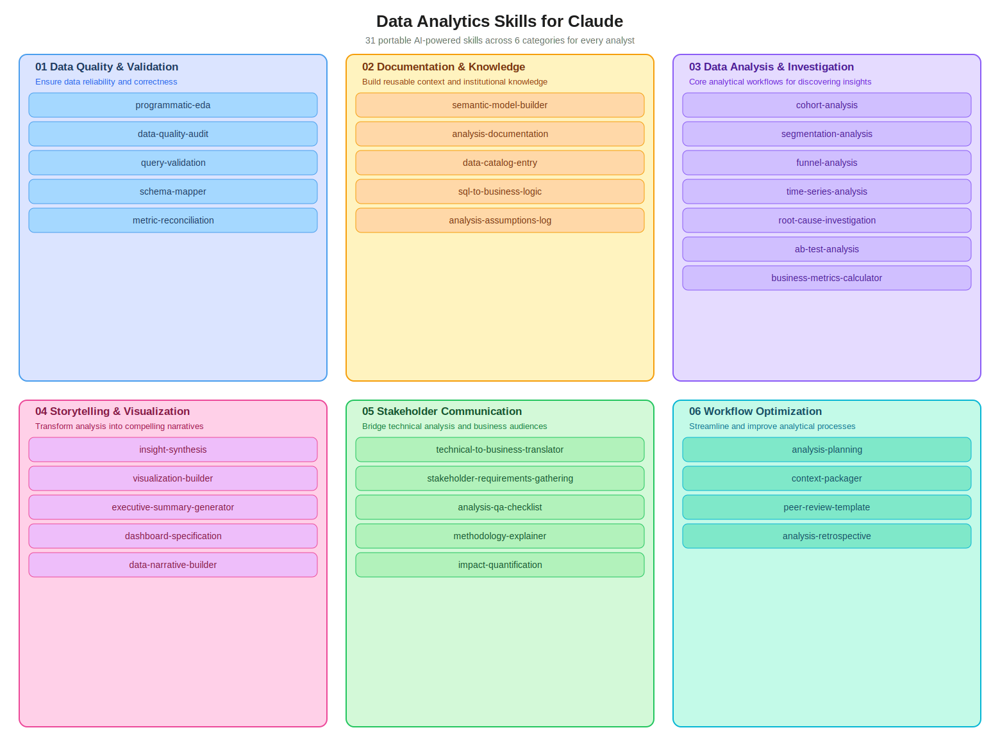

<div align="center">

# Data Analytics Skills for Claude

**31 portable AI-powered skills that turn Claude into a hands-on analytics partner**

*No setup required · Works for any company or industry*

<br>

[](./README.md#-skill-categories)&nbsp;
[](./README.md#-skill-categories)&nbsp;
[](./README.md#-quick-start)&nbsp;
[](./README.md#why-these-skills-are-different)

</div>

---

## What's in this repo?

A structured library of **skills** (reusable instruction sets) that Claude activates on demand to help with every stage of the analyst workflow: from data quality checks and deep-dive analysis, through documentation and dashboards, all the way to stakeholder communication.

---

## 🗺️ Skill Map



> [Open interactive version on Excalidraw](https://excalidraw.com/#json=wWcmLjEVHAYl4I4fynPSm,d8UC4Lexp2iSy5OPfIyJPQ)

---

## Why these skills are different

> [!NOTE]
> Traditional AI assistants require extensive upfront configuration — schemas, metric definitions, business rules — before they're useful. **These skills work on-demand.**

| Traditional approach | These skills |
|---------------------|--------------|
| Needs prep before use | Zero setup required |
| Breaks when business rules change | Adapts naturally |
| Company-specific, hard to share | Portable across any org |
| Silent on assumptions | Teaches you what context matters |

Each skill asks targeted questions to gather exactly what it needs, then executes a complete, structured workflow.

---

## 📚 Skill Categories

<details>
<summary><b>🔍 01 &nbsp;·&nbsp; Data Quality & Validation</b> &nbsp;&nbsp; <code>5 skills</code></summary>
<br>

*Foundation — start here whenever you're working with new data.*

| Skill | What it does |
|-------|-------------|
| **[programmatic-eda](01-data-quality-validation/programmatic-eda/)** | Systematic exploratory data analysis with automated sanity checks |
| **[data-quality-audit](01-data-quality-validation/data-quality-audit/)** | Comprehensive quality assessment against business rules and schema |
| **[query-validation](01-data-quality-validation/query-validation/)** | SQL review for correctness, performance, and edge cases |
| **[schema-mapper](01-data-quality-validation/schema-mapper/)** | Understand database relationships and table structures |
| **[metric-reconciliation](01-data-quality-validation/metric-reconciliation/)** | Investigate discrepancies between metric sources |

</details>

<details>
<summary><b>📝 02 &nbsp;·&nbsp; Documentation & Knowledge</b> &nbsp;&nbsp; <code>5 skills</code></summary>
<br>

*Build reusable context so you never explain the same thing twice.*

| Skill | What it does |
|-------|-------------|
| **[semantic-model-builder](02-documentation-knowledge/semantic-model-builder/)** | Create a shared semantic layer for key metrics and dimensions |
| **[analysis-documentation](02-documentation-knowledge/analysis-documentation/)** | Document findings with reproducible methodology |
| **[data-catalog-entry](02-documentation-knowledge/data-catalog-entry/)** | Standardized metadata and descriptions for data assets |
| **[sql-to-business-logic](02-documentation-knowledge/sql-to-business-logic/)** | Translate complex SQL into plain business language |
| **[analysis-assumptions-log](02-documentation-knowledge/analysis-assumptions-log/)** | Track every assumption and decision in an analysis |

</details>

<details>
<summary><b>📊 03 &nbsp;·&nbsp; Data Analysis & Investigation</b> &nbsp;&nbsp; <code>7 skills</code></summary>
<br>

*Core workflows for the analytical heavy lifting.*

| Skill | What it does |
|-------|-------------|
| **[cohort-analysis](03-data-analysis-investigation/cohort-analysis/)** | Time-based cohort tracking with retention curves |
| **[segmentation-analysis](03-data-analysis-investigation/segmentation-analysis/)** | Customer/user segmentation with actionable profiles |
| **[funnel-analysis](03-data-analysis-investigation/funnel-analysis/)** | Conversion funnel with drop-off root-cause |
| **[time-series-analysis](03-data-analysis-investigation/time-series-analysis/)** | Trend detection, seasonality, and forecasting |
| **[root-cause-investigation](03-data-analysis-investigation/root-cause-investigation/)** | Structured diagnosis of unexpected metric changes |
| **[ab-test-analysis](03-data-analysis-investigation/ab-test-analysis/)** | Rigorous experiment analysis with significance testing |
| **[business-metrics-calculator](03-data-analysis-investigation/business-metrics-calculator/)** | Standard business metric calculation with benchmarks |

</details>

<details>
<summary><b>🎨 04 &nbsp;·&nbsp; Data Storytelling & Visualization</b> &nbsp;&nbsp; <code>5 skills</code></summary>
<br>

*Turn raw findings into insights that drive decisions.*

| Skill | What it does |
|-------|-------------|
| **[insight-synthesis](04-data-storytelling-visualization/insight-synthesis/)** | Structure analysis outputs into clear business insights |
| **[visualization-builder](04-data-storytelling-visualization/visualization-builder/)** | Chart type selection, design guidance, and spec generation |
| **[executive-summary-generator](04-data-storytelling-visualization/executive-summary-generator/)** | Concise executive-ready summaries of complex analysis |
| **[dashboard-specification](04-data-storytelling-visualization/dashboard-specification/)** | Full dashboard requirements with metrics and layout |
| **[data-narrative-builder](04-data-storytelling-visualization/data-narrative-builder/)** | Craft a compelling story arc from analytical findings |

</details>

<details>
<summary><b>🤝 05 &nbsp;·&nbsp; Stakeholder Communication</b> &nbsp;&nbsp; <code>5 skills</code></summary>
<br>

*Bridge the gap between technical depth and business understanding.*

| Skill | What it does |
|-------|-------------|
| **[technical-to-business-translator](05-stakeholder-communication/technical-to-business-translator/)** | Reframe technical findings for a business audience |
| **[stakeholder-requirements-gathering](05-stakeholder-communication/stakeholder-requirements-gathering/)** | Structured elicitation to clarify what stakeholders actually need |
| **[analysis-qa-checklist](05-stakeholder-communication/analysis-qa-checklist/)** | Pre-delivery quality gate before sharing results |
| **[methodology-explainer](05-stakeholder-communication/methodology-explainer/)** | Explain analysis approach to any audience level |
| **[impact-quantification](05-stakeholder-communication/impact-quantification/)** | Estimate and frame the business impact of findings |

</details>

<details>
<summary><b>⚙️ 06 &nbsp;·&nbsp; Workflow Optimization</b> &nbsp;&nbsp; <code>4 skills</code></summary>
<br>

*Work smarter across every project.*

| Skill | What it does |
|-------|-------------|
| **[analysis-planning](06-workflow-optimization/analysis-planning/)** | Structure the approach before diving in |
| **[context-packager](06-workflow-optimization/context-packager/)** | Package context efficiently for AI-assisted analysis |
| **[peer-review-template](06-workflow-optimization/peer-review-template/)** | Structured peer review checklist for analytical work |
| **[analysis-retrospective](06-workflow-optimization/analysis-retrospective/)** | Post-analysis learning and process improvement |

</details>

---

## 🚀 Quick Start

> [!TIP]
> Describe your task to Claude naturally — it will select and activate the right skill automatically. No slash commands needed.

**Example:**

```
You:    "I need to understand why our activation rate dropped 12% last week"
Claude: [activates root-cause-investigation, asks for metric data and context]
You:    [provides data and business context]
Claude: [runs structured investigation with hypothesis testing]
```

### Which skill to start with?

| You need to... | Start here |
|---------------|-----------|
| Explore an unfamiliar dataset | `programmatic-eda` → `data-quality-audit` |
| Write or review SQL | `query-validation` + `schema-mapper` |
| Understand a metric drop/spike | `root-cause-investigation` |
| Analyze experiment results | `ab-test-analysis` |
| Build a dashboard | `dashboard-specification` + `visualization-builder` |
| Present to leadership | `executive-summary-generator` + `insight-synthesis` |
| Document your methodology | `analysis-documentation` + `analysis-assumptions-log` |
| Start a complex analysis | `analysis-planning` first, always |

---

## 📖 How skills work

Each skill follows the same **on-demand context pattern**:

1. **Request minimum viable context** — Claude asks only what's essential to start
2. **Execute the workflow** — structured, step-by-step analytical process
3. **Surface assumptions** — anything uncertain is flagged, not silently assumed
4. **Deliver a consistent output** — templated result you can share or iterate on

> [!NOTE]
> Skills degrade gracefully: if you can't provide everything, Claude states what it's assuming and proceeds.

---

## 🛠️ Customization

Skills work out-of-the-box. To make them company-specific, add a `references/` folder inside any skill with:

```
skill-name/
├── SKILL.md
└── references/
    ├── company-schema.md       ← your table/column definitions
    ├── metric-definitions.md   ← standard metric formulas
    └── business-rules.md       ← thresholds, edge cases, etc.
```

Claude will pull this context automatically when the skill runs.

---

## 🎓 Suggested ramp-up

**Week 1 — Get comfortable**
- Run `programmatic-eda` on a familiar dataset
- Practice providing context when Claude asks
- Use `analysis-planning` at the start of your next project

**Week 2–3 — Add your core toolkit**
- Set up `semantic-model-builder` for your key metrics (saves time forever)
- Add `query-validation` to your SQL workflow
- Pick 2 analysis skills that match your domain

**Week 4+ — Go advanced**
- Chain 4–5 skills end-to-end on a full project
- Add company-specific references to the skills you use most
- Build team context documents for shared onboarding

---

<div align="center">

**Version:** 1.1.0 &nbsp;·&nbsp; **Maintainer:** Nimrod Fisher &nbsp;·&nbsp; **Last Updated:** April 2026

</div>
